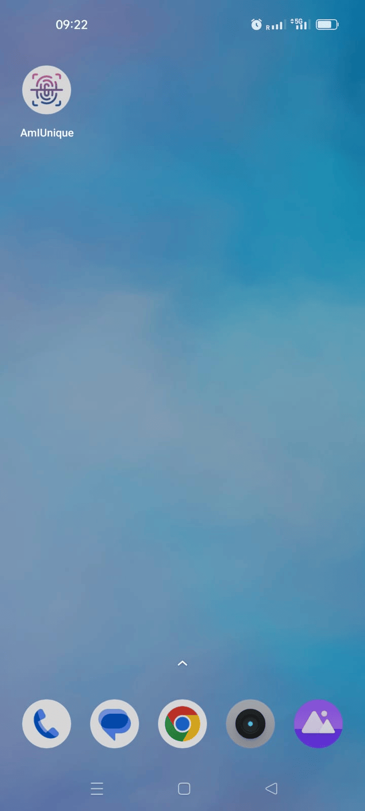

# AmIUnique Android
This repository contains AmIUnique device fingerprinting application and library source code. 

It accompanies the paper:

**EXADPrinter: Semi-Exhaustive Permissionless Device Fingerprinting Within the Android Ecosystem** (PETS 2026)

<p align="left">
  
</p>
<p align="left">
  <a  href="https://play.google.com/store/apps/details?id=com.amiunique.amiuniqueapp">
    
  </a>
</p>

### Citation

If you use this artifact in your research, please cite:

```

```

## 📱 [`AmIUnique Android Application`](./app/) 
The AmIUnique Android application is a demonstration app that integrates [`EXADPrinterLib`](EXADprinterLib) to collect device fingerprints on Android devices. The application extracts a large set of device attributes and sends them to a backend server for analysis.

### How the application works:

1. The app runs the fingerprint extraction process implemented in EXADPrinterLib.
2. The extracted attributes are compressed into a ZIP archive.
3. The archive is sent to a backend API endpoint for storage and analysis.

### Installing the application
You can use the application in two ways.

1. **Install from Google Play (recommended)**
Download the application directly from Google Play: [https://play.google.com/store/apps/details?id=com.amiunique.amiuniqueapp](https://play.google.com/store/apps/details?id=com.amiunique.amiuniqueapp)

2. **Build from source**
Clone the repository and build the application using Android Studio:

```
git clone https://github.com/AmIUniqueTools/AmIUniqueApp.git
```
Then open the project in Android Studio and build the app module.
  - **Build Prerequisites:** To build the project from source, the following environment was used:

    | Component | Version |
    |-----------|--------|
    | Android Studio | Android Studio Koala - 2024.1.1 Patch 1 -Build - #AI-241.18034.62.2411.12071903, built on July 10, 2024 |
    | Java version | Java 8 |
    | JVM |  17.0.15 |
    | Gradle | 8.7 |
    | Android Gradle Plugin | 8.5.1 |
    | Kotlin | 1.8.0 |
    | Compile SDK version | API 35 |
    | ADB version | 1.0.41|

You can also download a prebuilt debug version of the application: [`app-debug.apk`](./public/app-debug.apk).

- [`app-debug.apk`](./public/app-debug.apk)
3. **Configuring the fingerprint collection endpoint** 
If you want to collect fingerprints using your own backend, you can configure the API endpoint in two different ways.

  1. **Hardcode the endpoint in the source code:** Edit the Retrofit configuration file [RetrofitInstance.kt](app/src/main/java/com/amiunique/amiuniqueapp/network/RetrofitInstance.kt) and replace the `FALLBACK_URL` with your server URL.

  2. **Provide the endpoint dynamically when launching the app:** The application also supports passing the API endpoint via Intent parameters. Using adb:

  ```
  adb shell am start \
  -n "com.amiunique.amiuniqueapp/.presentation.MainActivity"\
  --es API_END_POINT "YOUR_ENDPOINT_URL"
  ```

The API request is defined in [`FingerprintApi.kt`](./app/src/main/java/com/amiunique/amiuniqueapp/network/FingerprintApi.kt). By default, the application sends fingerprints to:

```
<FALLBACK_URL>/saveFP/
```
To receive fingerprints, your backend must implement the same API schema.

## 📦 [`EXADPrinterLib`](EXADprinterLib)

**EXADPrinterLib** is an Android library that implements the core logic used to extract device fingerprints following the EXADPrinter framework.
The library collects a large set of device attributes accessible without requesting sensitive permissions, using three main techniques: **Shell Command Execution**, **Java Reflection**, and **Content Provider Inspection**.
More details are provided in the [Paper]()

The library is designed to be easily integrated into any Android application and provides a simple API to trigger fingerprint extraction and retrieve the resulting attribute set.

Below is a description of the key classes:

- [`FingerprintExtractor.kt`](EXADPrinterLib/src/main/java/com/amiunique/exadprinterlib/FingerprintExtractor.kt):  
  Contains the core logic for attribute extraction. It coordinates the three extraction techniques in the following order: executes shell commands, extracts SDK attributes via reflection, and finally queries content providers.

- [`ShellCommandsExplorer.kt`](EXADPrinterLib/src/main/java/com/amiunique/exadprinterlib/ShellCommandsExplorer.kt):  
  Manages the list of shell commands to execute and contains the logic for their execution.

- [`SDKExplorer.kt`](EXADprinterLib/src/main/java/com/com.exadprinter/fingerprintinglib/SDKExplorer.kt):  
  Handles the inspection of Android native APIs via reflection. It begins by loading a JSON file of documented classes and initializing the `InstanceFactory`, which creates object instances. This process uses the `SystemServiceFactory` to access available system services via the `Context` class, after which it extracts fields and invokes methods.

- [`ContentProviderExplorer.kt`](EXADPrinterLib/src/main/java/com/amiunique/exadprinterlib/ContentProviderExplorer.kt):  
  Responsible for querying a predefined list of content provider URIs and collecting their exposed values.

- [`InstanceFactory.kt`](EXADPrinterLib/src/main/java/com/amiunique/exadprinterlib/InstanceFactory.kt) and  
  [`SystemServiceFactory.kt`](EXADPrinterLib/src/main/java/com/amiunique/exadprinterlib/SystemServiceFactory.kt):  
  Provide object instantiation logic for SDK classes and access to Android system services, respectively.

- [`FingerprintingUtils.kt`](EXADPrinterLib/src/main/java/com/amiunique/exadprinterlib/FingerprintingUtils.kt):  
  Contains utility methods used throughout the fingerprinting process.

- [`RootChecker.kt`](EXADPrinterLib/src/main/java/com/amiunique/exadprinterlib/RootChecker.kt):  
  Checks whether the device is rooted.

### Installation

You can install EXADPrinterLib using one of the following methods:

1. Using Maven Central (recommended)
Add Maven Central to your repositories if it is not already included:

```gradle
repositories {
    mavenCentral()
}
```

Then add the [dependency](https://central.sonatype.com/artifact/io.github.amiuniquetools/exadprinterlib) in your build.gradle file:
```
dependencies {
    implementation("io.github.amiuniquetools:exadprinterlib:1.0.0")
}
```
Replace <version> with the latest available release.

2. Using the .aar file from GitHub Releases
  - Download the `.aar` file from the project's releases page: [https://github.com/AmIUniqueTools/AmIUniqueApp/releases](https://github.com/AmIUniqueTools/AmIUniqueApp/releases)
  - Then follow the Android documentation to include an `.aar` dependency in your project: [https://developer.android.com/studio/projects/android-library#psd-add-aar-jar-dependency](https://developer.android.com/studio/projects/android-library#psd-add-aar-jar-dependency)

3. Building the library from source
Clone the repository and include the library module in your project:
```
git clone https://github.com/AmIUniqueTools/AmIUniqueApp.git
```

### Usage

Below is a minimal example showing how to initialize the different explorers and extract a device fingerprint using EXADPrinterLib.

```kotlin
import com.amiunique.exadprinterlib.ClassesJsonReader
import com.amiunique.exadprinterlib.ContentProviderExplorer
import com.amiunique.exadprinterlib.FingerprintExtractor
import com.amiunique.exadprinterlib.InstanceFactory
import com.amiunique.exadprinterlib.SDKExplorer
import com.amiunique.exadprinterlib.ShellCommandsExplorer

private lateinit var fingerprintExtractor: FingerprintExtractor

// ------------------------------------------------------------
// 1. Initialize the ShellCommandsExplorer
// ------------------------------------------------------------

// This component executes a predefined set of shell commands
// to collect system-level information (CPU, memory, network, etc.).
// If you want to customize the commands, you can pass your own commandsMap.
val adbExplorer = ShellCommandsExplorer()

// ------------------------------------------------------------
// 2. Load the list of Android SDK classes to explore
// ------------------------------------------------------------

// By default, the library loads a JSON file (classes.json) from assets
// containing a list of Android SDK classes to inspect via reflection.
val classesList = ClassesJsonReader().readFromAssets(applicationContext)

// Alternatively, you can provide your own class list file.
// Example:
// val classesList = ClassesJsonReader().readFromFile(File("/path/to/classes.json"))

// ------------------------------------------------------------
// 3. Create the InstanceFactory
// ------------------------------------------------------------

// InstanceFactory is responsible for creating instances of SDK classes
// when exploring them via reflection.
val instanceFactory = InstanceFactory(applicationContext)

// ------------------------------------------------------------
// 4. Initialize the SDKExplorer
// ------------------------------------------------------------

// SDKExplorer iterates over the list of classes and extracts accessible
// attributes and method outputs using reflection.
val sdkExplorer = SDKExplorer(instanceFactory, classesList)

// ------------------------------------------------------------
// 5. Initialize the ContentProviderExplorer
// ------------------------------------------------------------

// This component explores accessible Android Content Providers
// and extracts available data from them.
val contentProviderExplorer = ContentProviderExplorer(applicationContext)

// ------------------------------------------------------------
// 6. Create the FingerprintExtractor
// ------------------------------------------------------------

// FingerprintExtractor orchestrates all explorers and aggregates
// the collected attributes into a unified device fingerprint.
fingerprintExtractor = FingerprintExtractor(
    sdkExplorer,
    adbExplorer,
    contentProviderExplorer,
    applicationContext
)

// ------------------------------------------------------------
// 7. Extract the device fingerprint
// ------------------------------------------------------------

// The resulting fingerprint is a collection of attributes obtained
// from SDK reflection, shell commands, and content providers.
val fingerprint = fingerprintExtractor.extractFingerprint().toMutableList()
```
